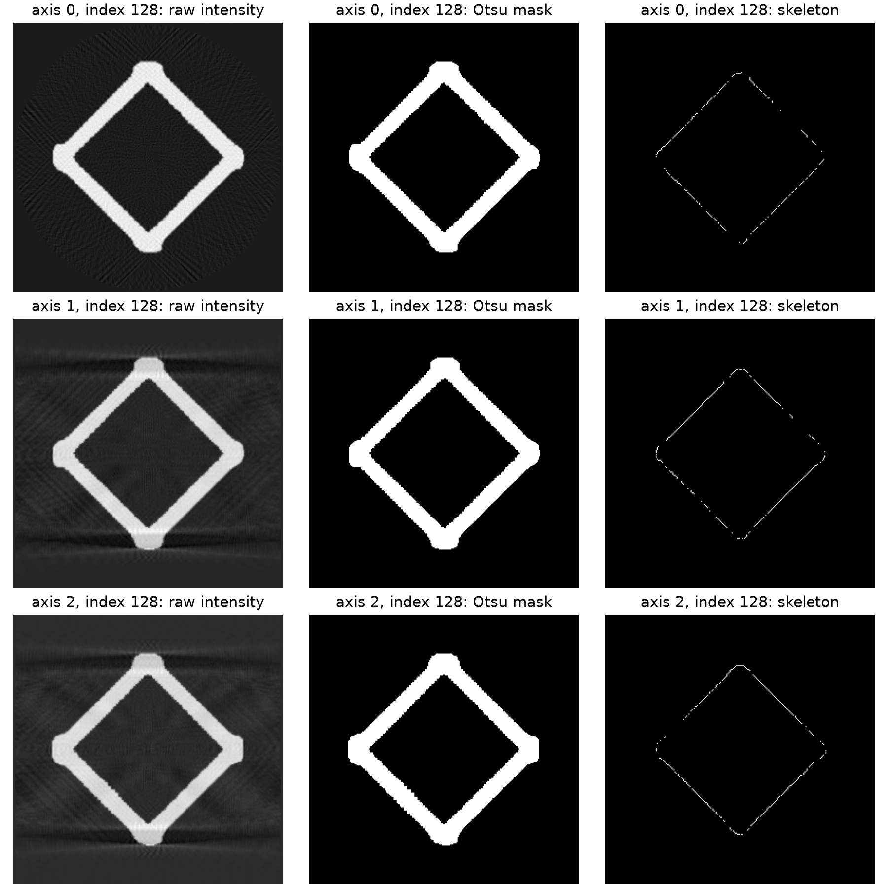

# Repository asset analysis

This is a non-destructive inventory produced by `Scripts/analyze_project_assets.py`.
Git-LFS pointers are reported as unavailable source assets; their expected size and object ID are preserved.

## File inventory

| Path | Present bytes | Kind | Key result |
| --- | ---: | --- | --- |
| `.agents/skills/nde_report_expert/SKILL.md` | 1,809 | text_or_source | --- |
| `.agents/skills/nde_report_expert/scripts/3d_visualize.py` | 6,729 | text_or_source | import numpy as np |
| `.claude/settings.local.json` | 2,752 | json | keys=permissions |
| `.gitattributes` | 186 | text_or_source | data/9x9x9_octet_lattice/9x9x9_octet_lattice.tif filter=lfs diff=lfs merge=lfs -text |
| `.gitignore` | 3,200 | text_or_source | # Byte-compiled / optimized / DLL files |
| `.vscode/settings.json` | 156 | json | keys=github.copilot.chat.codeGeneration.useInstructionFiles, python.defaultInterpreterPath |
| `DATA_SCIENCE_CHALLENGE_2026.pdf` | 1,514,086 | unrecognized_binary |  |
| `README.md` | 30,494 | text_or_source | # 2026 Data Science Challenge: Agentic AI for Materials Science  |
| `Scripts/analysis_report.md` | 11,052 | text_or_source | # DSSI 2026 repository pre-challenge analysis |
| `Scripts/analyze_json.py` | 6,989 | text_or_source | """ |
| `Scripts/analyze_npy.py` | 3,235 | text_or_source | """ |
| `Scripts/analyze_project_assets.py` | 14,166 | text_or_source | #!/usr/bin/env python3 |
| `Scripts/analyze_tiff_stl.py` | 7,025 | text_or_source | #!/usr/bin/env python3 |
| `Scripts/create_pdf_contacts.py` | 2,883 | text_or_source | #!/usr/bin/env python3 |
| `Scripts/outputs/introduction_slides_contact_sheet.png` | 371,679 | png_image | 1280×1952, RGB |
| `Scripts/outputs/json_octet_truss_8x8x8_wireframe.png` | 905,360 | png_image | 960×960, RGBA |
| `Scripts/outputs/json_polyhedron_1x1x1_wireframe.png` | 167,204 | png_image | 960×960, RGBA |
| `Scripts/outputs/main_challenge_pages_contact_sheet.png` | 945,892 | png_image | 1280×1952, RGB |
| `Scripts/outputs/npy_center_slices.png` | 441,171 | png_image | 1680×600, RGBA |
| `Scripts/outputs/npy_histogram.png` | 22,053 | png_image | 840×480, RGBA |
| `Scripts/outputs/npy_isosurface.png` | 484,077 | png_image | 960×960, RGBA |
| `Scripts/outputs/tiff_stl_report.json` | 2,227 | json | keys= |
| `d.ipynb` | 312 | text_or_source | { |
| `data/9x9x9_octet_lattice/9x9x9_octet_lattice.tif` | 135 | git_lfs_pointer | LFS object expected: 1038433319 bytes |
| `data/9x9x9_octet_lattice/ground_truth_segmentation_slice_380.png` | 73,359 | png_image | 800×800, RGBA |
| `data/9x9x9_octet_lattice/note.txt` | 74 | text_or_source | this is the 210127_Brian_Tran_strut_lattices_0point5dash1 1 Slices dataset |
| `data/missing_struts/file_names.txt` | 129 | git_lfs_pointer | LFS object expected: 1720 bytes |
| `data/missing_struts/octet_truss_9x9x9.json` | 132 | git_lfs_pointer | LFS object expected: 3938777 bytes |
| `data/missing_struts/registered_jsons/210127_Brian_Tran_strut_lattices_0point5dash1 1 Slices.json` | 132 | git_lfs_pointer | LFS object expected: 4958672 bytes |
| `data/missing_struts/stls/0.1.stl` | 134 | git_lfs_pointer | LFS object expected: 175572984 bytes |
| `data/missing_struts/stls/0.5.stl` | 134 | git_lfs_pointer | LFS object expected: 174932884 bytes |
| `data/missing_struts/stls/0.stl` | 134 | git_lfs_pointer | LFS object expected: 175732184 bytes |
| `data/missing_struts/stls/1.stl` | 134 | git_lfs_pointer | LFS object expected: 174118484 bytes |
| `data/missing_struts/tif_stacks/210127_Brian_Tran_strut_lattices_0point5dash1 1 Slices.tif` | 135 | git_lfs_pointer | LFS object expected: 1038433319 bytes |
| `data/octet_truss_8x8x8/octet_truss_8x8x8.json` | 2,767,653 | json | keys=junctions, struts, unit_cells |
| `data/unitcell/ground_truth_segmentation_image.png` | 1,247,381 | png_image | 1765×1838, RGBA |
| `data/unitcell/note.txt` | 68 | text_or_source | this is the octet_truss_unit_cell_no_defects_0256_xray_recon dataset |
| `data/unitcell/polyhedron_1x1x1.json` | 3,116 | json | keys=junctions, struts, unit_cells |
| `data/unitcell/unitcell.npy` | 67,108,992 | numpy_volume | shape=[256, 256, 256]; Otsu=0.005813093855977058 |
| `data.ipynb` | 2,094 | text_or_source | { |
| `images/segmentation.png` | 112,117 | png_image | 1584×1528, RGBA |
| `images/skeleton.png` | 294,254 | png_image | 1584×1528, RGBA |
| `images/slice.png` | 907,571 | png_image | 1584×1528, RGBA |
| `presentation/DSSI_Challenge_2026_Introduction.pdf` | 997,279 | unrecognized_binary |  |
| `requirements.txt` | 47 | text_or_source | numpy |
| `src/mcp_server.py` | 2,039 | text_or_source | from fastmcp import FastMCP |
| `src/skeletonization.py` | 1,599 | text_or_source | import numpy as np |

## Unit-cell NDE metrics

| Metric | Value |
| --- | ---: |
| Volume shape | [256, 256, 256] |
| Intensity mean ± SD | 0.000539 ± 0.002418 |
| Otsu threshold | 0.005813 |
| Foreground voxels / fraction | 717,852 / 4.2787% |
| 26-connected components | 1 |
| Largest-component foreground fraction | 100.0000% |
| Skeleton voxels | 3,182 |
| Skeleton endpoints (degree 1) | 39 |
| Skeleton branch voxels (degree ≥3) | 137 |

