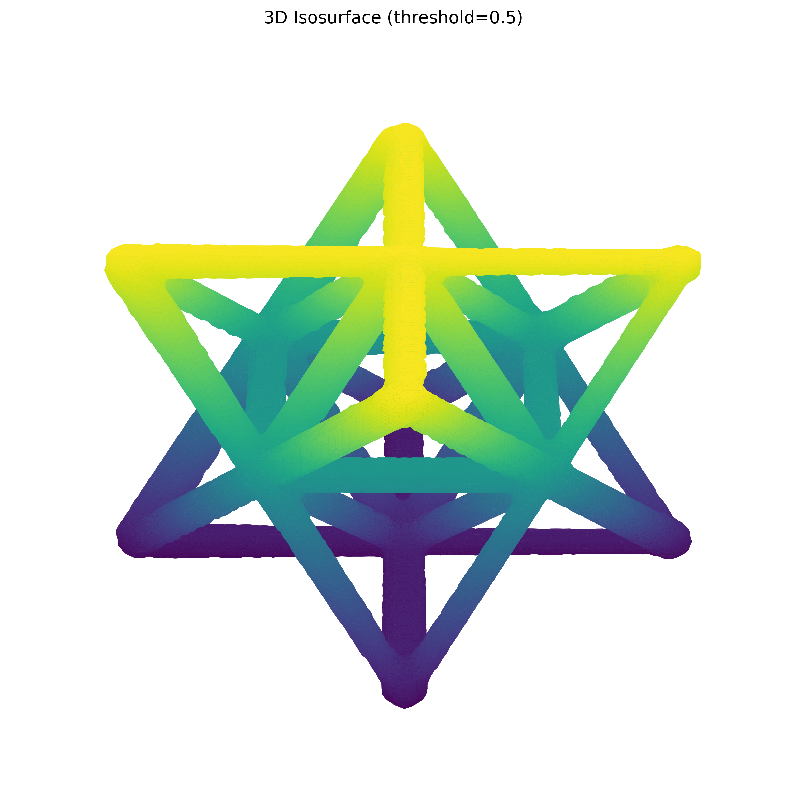
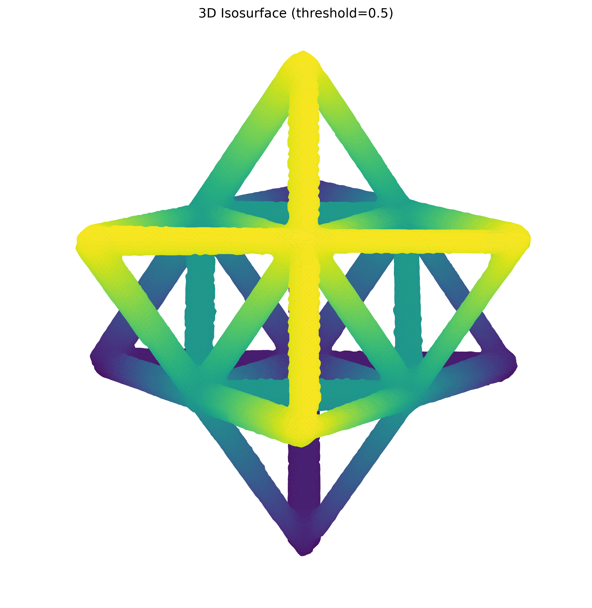
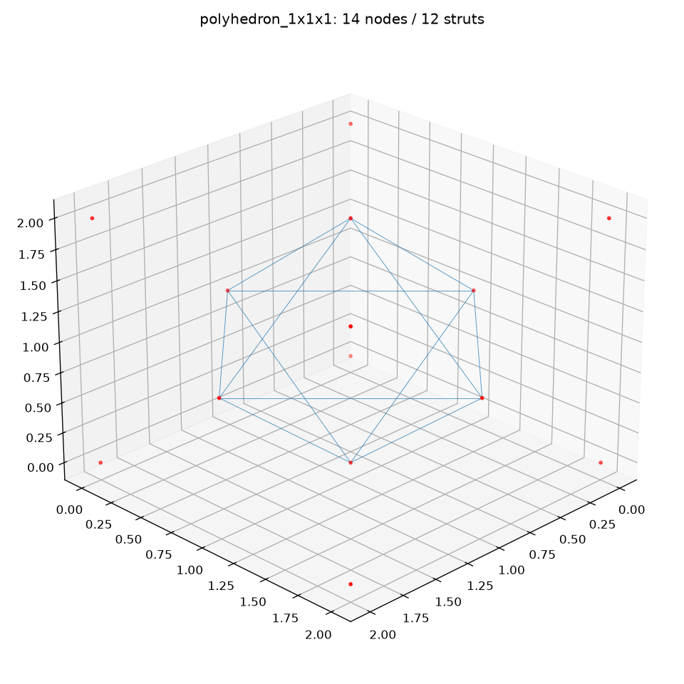
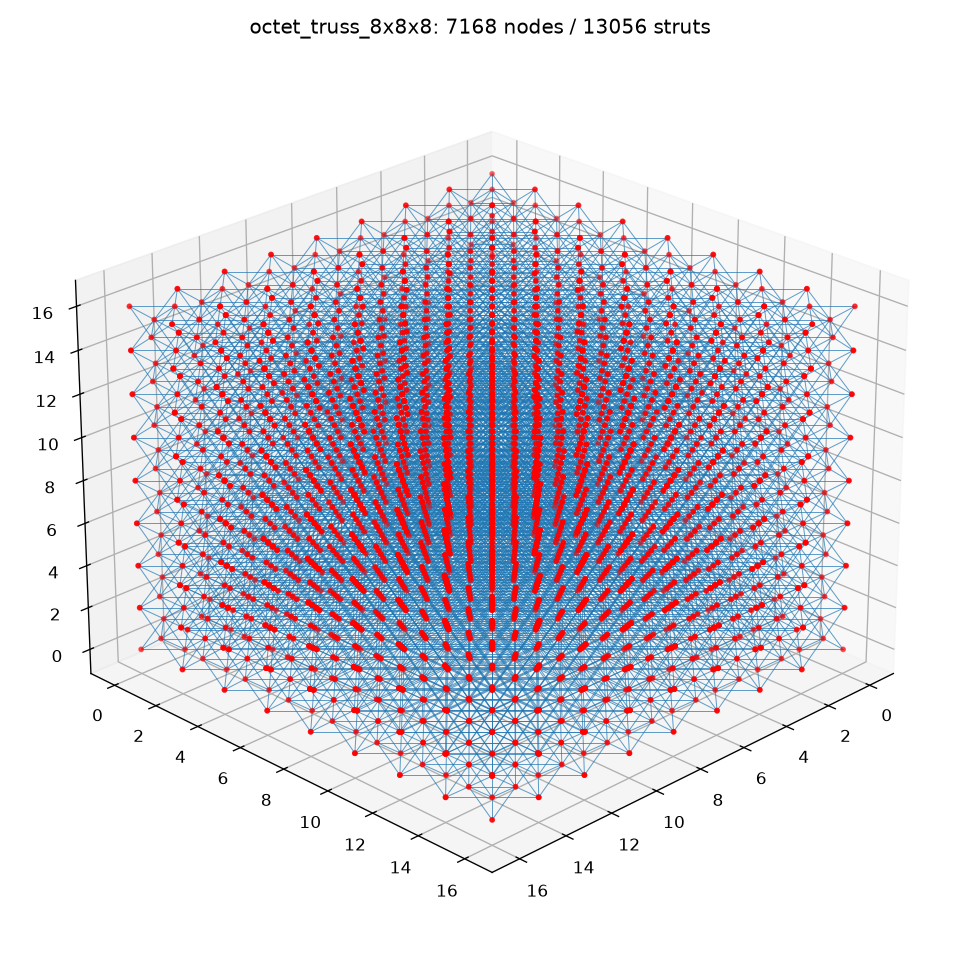
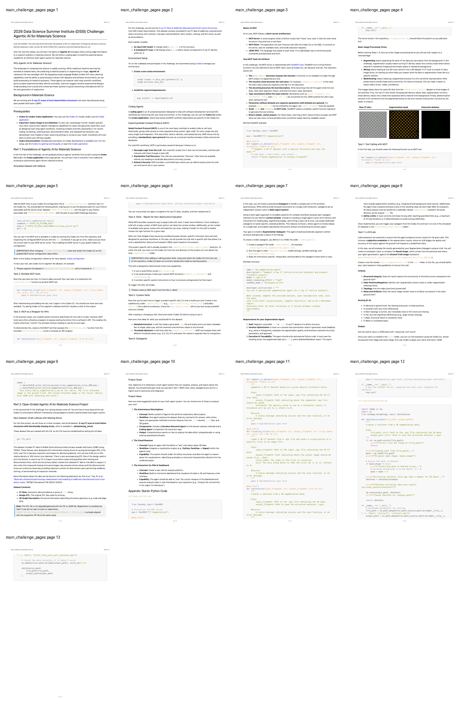
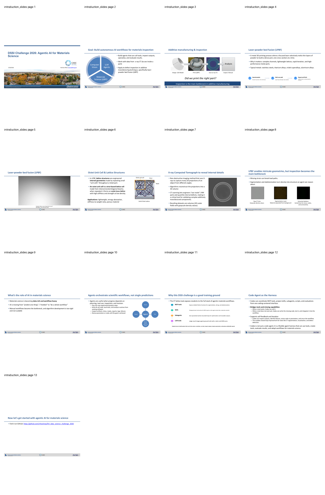

# DSSI 2026 repository pre-challenge analysis

This is a read-only scientific and document review. No challenge task in
`README.md` or either PDF was implemented. No source file outside `Scripts/`
was edited by this review.

## Review scope and data availability

- The working-tree inventory contains 46 reviewed files at the final inventory
  pass (excluding Git's internal object database and the inventory's own output
  directory). File hashes, file types, and structured metadata are in
  [asset_inventory.json](analysis_output/asset_inventory.json).
- The configured Python interpreter is the supplied `DSC` environment and has
  the required scientific packages: NumPy, Matplotlib, scikit-image, tifffile,
  and FastMCP.
- Git LFS is **not installed**, so the underlying missing-strut TIFF, STL, and
  two graph JSON payloads are unavailable. The files visible in `data/` are
  valid Git-LFS pointers, not corrupted data files.
- The manifest references 2,786,122,343 bytes of LFS payload. One 1,038,433,319
  byte TIFF object is referenced from two paths; deduplicated LFS object payload
  is 1,747,689,024 bytes. Every pointer's SHA-256 object ID and expected size is
  in [tiff_stl_report.json](outputs/tiff_stl_report.json) and the inventory.

## Script audit

All analysis code remains under `Scripts/` and runs successfully with `DSC`:

| Script | Verification and purpose |
| --- | --- |
| `analyze_npy.py` | Corrected an intensity-scale error: raw CT values peak at 0.0153, so thresholds 0.3--0.7 must be normalized before reporting foreground fractions. It now produces correct raw-equivalent thresholds, histogram, slices, and isosurface. |
| `analyze_json.py` | Parses the complete unit-cell and 8×8×8 graph JSONs, validates endpoint references, measures topology, and renders wireframes. It also reports connectivity after welding duplicate spatial coordinates. |
| `analyze_project_assets.py` | Creates the complete file inventory, exact NumPy statistics, Otsu mask/skeleton metrics, and visual gallery. It recognizes LFS pointers before dispatching a format parser. |
| `analyze_tiff_stl.py` | Records all current TIFF/STL LFS pointers. If real payloads are restored, it will stream TIFF pages for global statistics/slice previews and stream binary STL triangles for exact bounds. |
| `create_pdf_contacts.py` | Renders every PDF page using `pdftoppm` and makes the two contact sheets below. |

## Present data assets

### Defect-free unit-cell CT volume

`data/unitcell/unitcell.npy` is a valid float32 volume of shape 256×256×256
(16,777,216 voxels; 67,108,864 array bytes). All values are finite.

| Metric | Result |
| --- | ---: |
| Intensity min / max | -0.00312875 / 0.01525769 |
| Mean ± SD | 0.00053907 ± 0.00241824 |
| 1st / 50th / 99th percentile | -0.00107961 / 0 / 0.01265840 |
| Otsu threshold | 0.00581309 |
| Material voxels / fraction | 717,852 / 4.2787% |
| 26-connected mask components | 1 |
| Largest-component fraction | 100% |
| Skeleton voxels | 3,182 |
| Skeleton endpoints / branch voxels | 39 / 137 |

The intensity histogram is bimodal: a dominant near-zero reconstruction
background and a material peak near 0.012--0.013. The central slices visibly
contain radial/streak reconstruction artifacts around a clean diamond-shaped
section; global Otsu suppression removes those artifacts while retaining one
connected lattice body. The skeleton has local pixel-level breaks in the
representative centre planes, so endpoint and branch-voxel counts are useful
complexity indicators rather than a literal CAD strut count.

The required two 3D views from the project NDE skill were rendered at exactly
the requested (elevation, azimuth) pairs: (30°, 45°) and (60°, 45°). Both show
the expected intact octet-truss topology, with modest scalloping/voxelization
on strut surfaces but no missing member.

| View A: elevation 30°, azimuth 45° | View B: elevation 60°, azimuth 45° |
| --- | --- |
|  |  |

### Complete graph JSONs

`polyhedron_1x1x1.json` is the defect-free CAD graph for one octet cell:

- 14 stored junctions within a [0, 2]³ bounding box; 12 struts, all length
  √2 and thickness 0.1.
- Six face-centre junctions form the one active component, all degree four.
  The eight cube-corner junction records have degree zero; this is intentional
  representation metadata, not a physical disconnection.
- All 12 strut endpoints are valid; one unit-cell record references all 12.

`octet_truss_8x8x8.json` is a regular reference lattice:

- 7,168 stored junction records, 13,056 struts, and 512 unit-cell records;
  coordinate bounds are [0, 16]³ and every strut has length √2 and thickness
  0.1.
- It intentionally stores cell-local node IDs: direct ID connectivity gives
  512 components (largest 14 nodes), with 7,168 records but only 2,457 unique
  positions.
- Welding equal coordinate positions gives one physically connected component
  of all 2,457 positions, with degree distribution `{3: 8, 5: 84, 8: 678,
  12: 1687}`. This weld step is mandatory before interpreting global graph
  disconnections as defects.
- The JSON has no invalid strut endpoints. Each cell references 24--36 struts
  (mean 25.5) because boundaries have fewer shared/repeated edges.

### PNG visual evidence

- `images/slice.png` is an opaque 1584×1528 CT-slice rendering. It shows a
  diamond-grid lattice on a noisy grey field, plus sparse green overlay pixels;
  it is not a pure greyscale export.
- `images/segmentation.png` is the matching opaque 1584×1528 binary mask with
  exactly two RGB colors (black and amber). It retains the lattice cleanly but
  has expected cropped/partial edge struts.
- `images/skeleton.png` is the matching opaque 1584×1528 green centreline;
  antialiasing creates 206 RGB values. It preserves the primary diamond grid
  but contains small disconnected fragments, especially near the perimeter.
- `data/9x9x9_octet_lattice/ground_truth_segmentation_slice_380.png` is an
  opaque 800×800 labelled ground-truth visualization. It visibly contains a
  connected strut region only at the left and largely isolated nodes elsewhere,
  consistent with a deliberately missing-strut evaluation case.
- `data/unitcell/ground_truth_segmentation_image.png` is not a binary slice;
  it is a 1765×1838 opaque grayscale 3D render of the intact octet structure,
  with visible surface texture and black background.

### LFS-only assets

The following are pointers and cannot responsibly be treated as a valid TIFF,
STL, or graph until `git lfs pull` has restored their payloads:

| Asset | Expected payload |
| --- | ---: |
| `9x9x9_octet_lattice.tif` and duplicate missing-struts TIFF stack | 1,038,433,319 bytes each; same LFS object |
| STL designs at nominal 0%, 0.1%, 0.5%, 1% missing struts | 175,732,184; 175,572,984; 174,932,884; 174,118,484 bytes |
| `octet_truss_9x9x9.json` | 3,938,777 bytes |
| registered 0.5% JSON | 4,958,672 bytes |

The challenge brief notes that original STL designs are not aligned with the
TIFF/JSON coordinate systems. The registered 0.5% JSON is explicitly the
alignment-ready companion to its TIFF; that should be the first real-data
analysis target once LFS assets exist locally.

## Challenge documents: full page/slide review

Both PDFs have 13 pages and were text-extracted and visually rendered in full.

### `DATA_SCIENCE_CHALLENGE_2026.pdf`

The main PDF is the rendered form of the repository challenge brief (title
metadata names `DATA_SCIENCE_CHALLENGE_2026.md`, created 2026-07-15). Its 13
pages establish the following sequence:

1. Motivate agentic AI for LPBF X-ray CT inspection and introduce the simulated
   defect set (bent, broken, missing, thin struts, dross).
2. Define the inputs as CAD meshes and [0, 1] CT NumPy volumes; specify Conda
   environment setup.
3. Explain MCP client/server/JSON-RPC concepts and FastMCP tool exposure.
4. Define segmentation, slicing, skeletonization, illustrate their outputs,
   and introduce the segmentation tool stub.
5. Specify MCP configuration plus slice-visualization and skeleton wrapper
   stubs.
6. Explain the supplied NDE skill and introduce custom skills/subagents.
7. Define the segmentation-subagent constraints: iterative visual feedback,
   traceable output, slice 380, and termination bounds.
8. Define the exact 0--5 LLM-evaluation rubric: structural connectivity, false
   positives/negatives, nodes/topology, and artifact control; required output
   is JSON with `reasoning` and `score`.
9. Start the open-ended missing-strut project: Ti5553, 4.56 mm cells, 10%
   relative density, nominal 350 µm struts; require Git LFS and flag STL/scan
   registration.
10. Offer three project directions: autonomous data explorer, visual reasoner,
    and interactive co-pilot/dashboard.
11--13. Reprint the intentionally unimplemented starter MCP and
    skeletonization code.

### `DSSI_Challenge_2026_Introduction.pdf`

The slide deck supplies the materials-science rationale behind the brief:

1. Title and LLNL attribution.
2. A three-way framing: computer vision, LLM agents, and LPBF materials.
3--5. CAD → LPBF → X-ray CT → inspection workflow and the LPBF powder-layer
   cycle.
6. Octet cell/strut/node geometry and lightweight, energy-absorbing use cases.
7. CT as a reconstructed 3D density field for non-destructive internal
   inspection.
8. Missing struts break load paths; segmentation and skeletonization convert
   density into connectivity that an agent can reason about.
9--10. Why multi-step agent workflows are preferable to a single prediction:
   plan, execute, inspect, revise.
11. The instructional stack: MCP tools, skills, bounded subagents, and rubric
   based LLM evals.
12. Codex as a harness that can use or create tools and iterate from artifacts.
13. Repository link and transition into the challenge.

## Repository/starter-code state

- `src/mcp_server.py` deliberately contains three `pass` implementations. This
  is expected starter material; it was inspected but not changed.
- `src/skeletonization.py` is a working 3D boolean-mask skeletonizer; its
  hard-coded demo writes a skeleton only if explicitly run. It was not run
  against project data because the analysis scripts generated their own
  non-source outputs under `Scripts/analysis_output/`.
- `requirements.txt` exactly lists NumPy, Matplotlib, FastMCP, scikit-image,
  and tifffile. `data.ipynb` only imports them; `d.ipynb` is an empty notebook.
- The unit-cell graph JSON was already modified and the two notebooks were
  already untracked before this review; they were preserved untouched.
