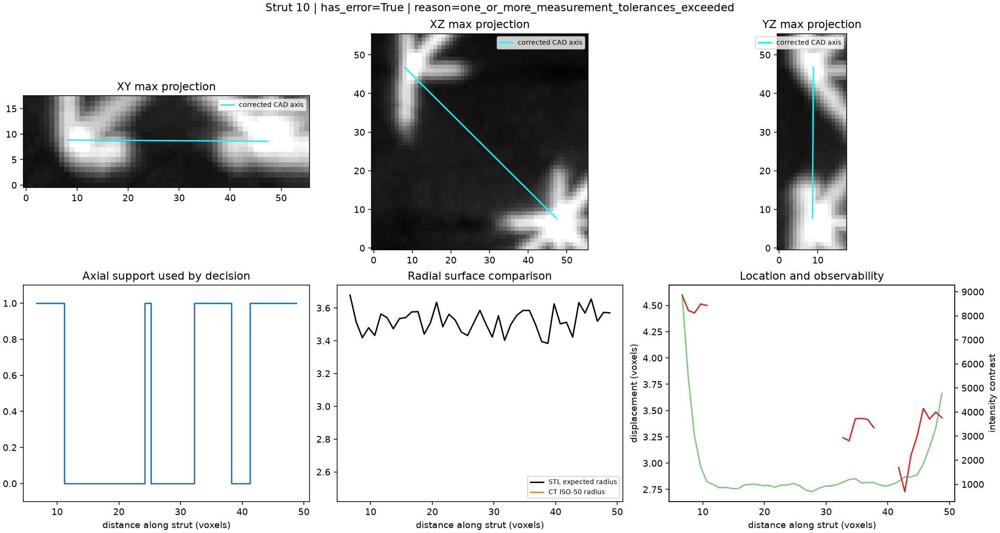
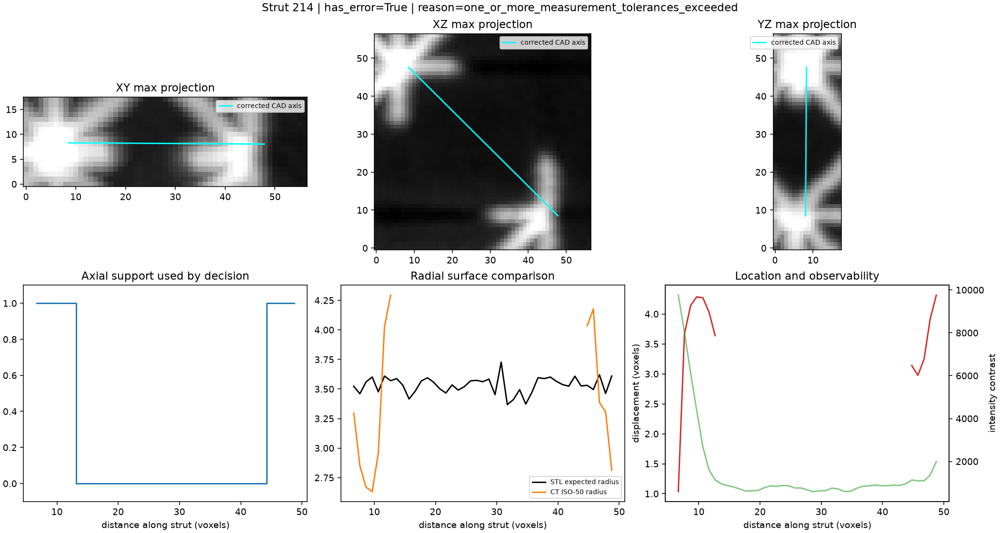
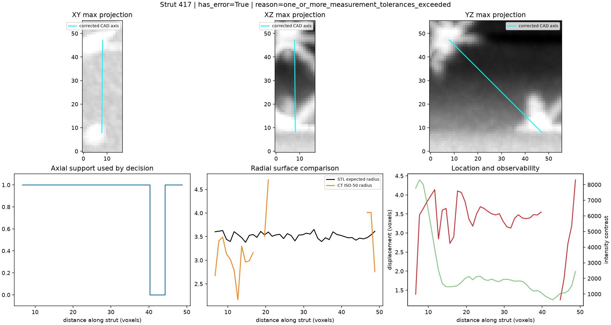
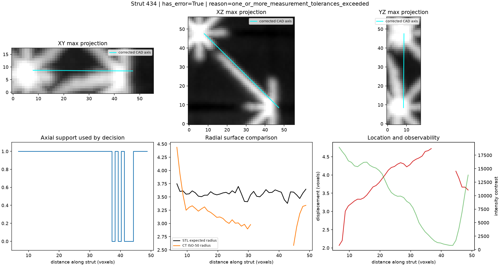
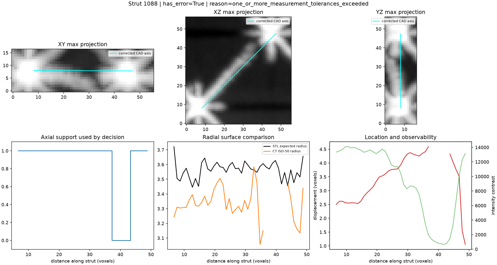
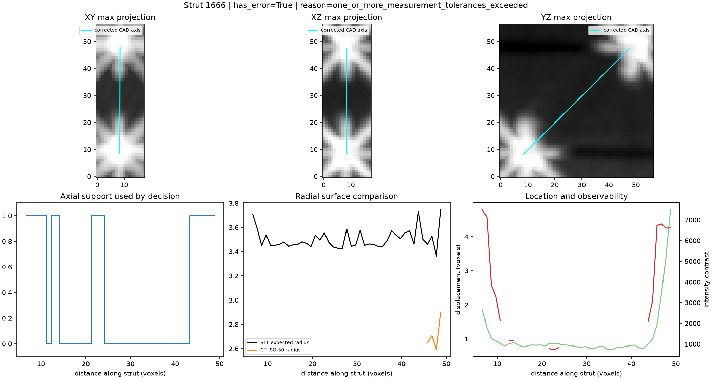
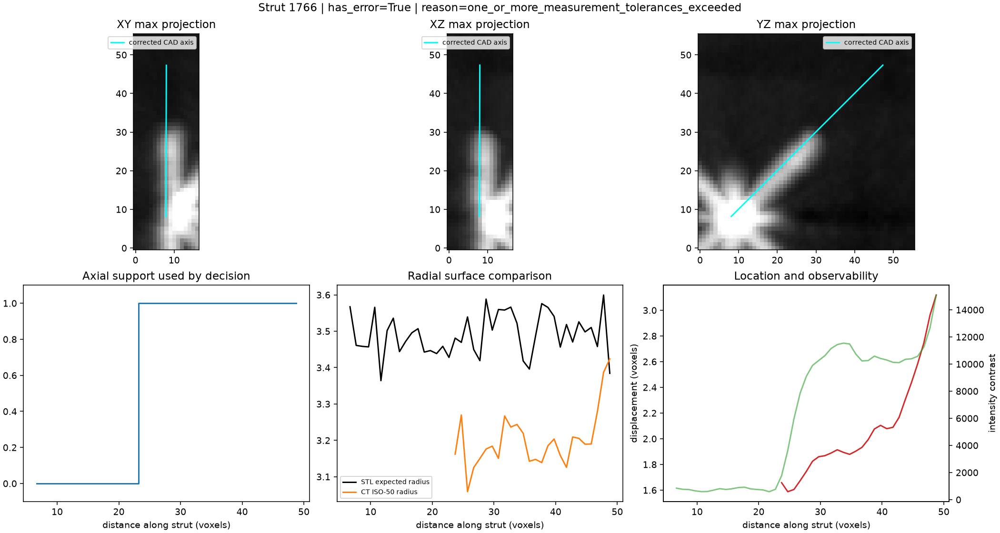
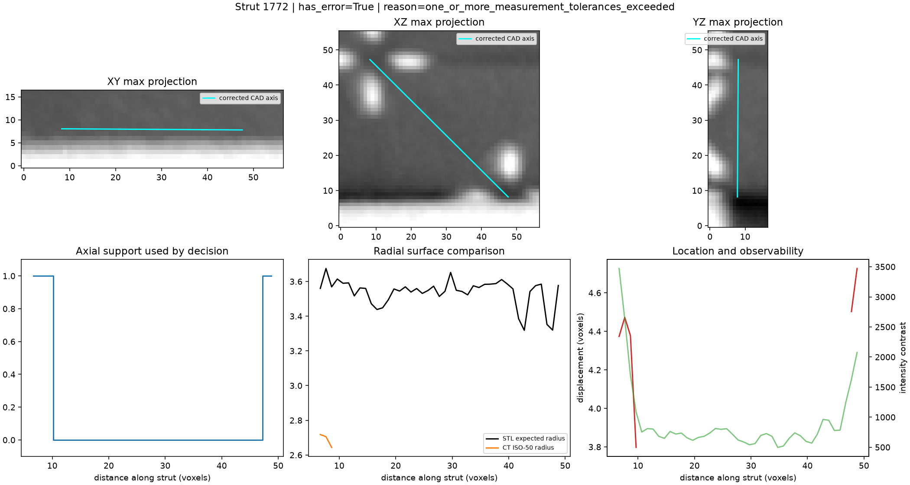
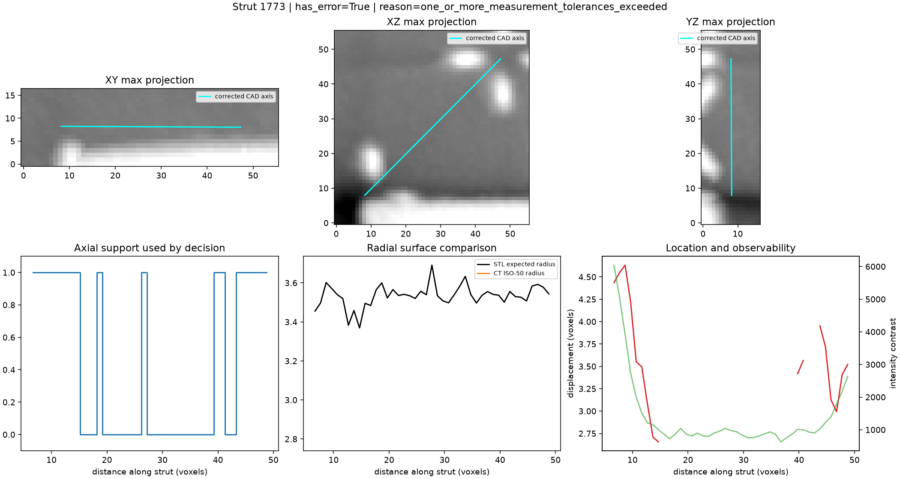
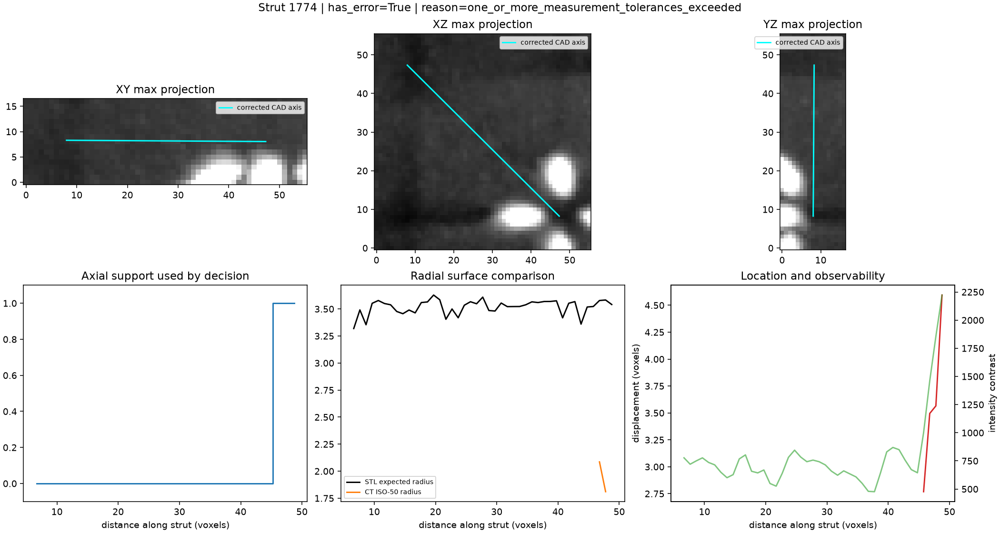

# Compact STL-to-TIFF strut metrology

## Result scope

`0.5.stl` is the specimen CAD used for printing. Its deliberate omissions are
reported as non-applicable design absences; only additional TIFF mismatches are
candidate errors. Missing-versus-broken subtype is not assigned.

## Registration

- Independent rigid correction: 0.169510 degrees, 2.373926 voxels.
- Held-out median absolute local ISO-50 offset: 0.8404135258426173 voxels.
- Conservative registration uncertainty used by decisions: 0.6296126413117267 voxels.

## Counts

- Processed: 18,468
- Error candidates: 324
- Clearly inside tolerance: 6,595
- Review-required: 10,810
- Non-applicable design/skin members: 739

## Evidence panels

Max projections can visually hide a gap; the axial support/radius plots below
each projection are the actual decision evidence.

## Limitations

- Synthetic tests establish numerical behavior, not real defect accuracy.
- Registration uncertainty includes CT noise and manufacturing surface variation.
- Candidate errors require scientific/manual review; no subtype is claimed.
- The segmented TIFF is not used as ground truth.
