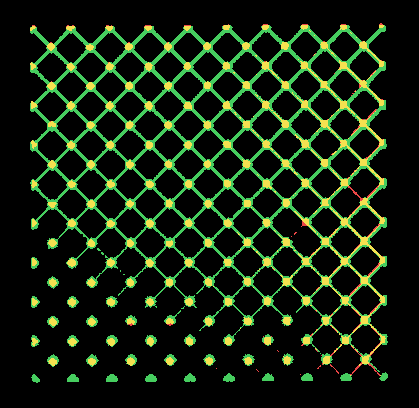
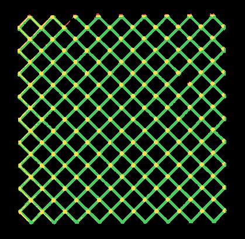
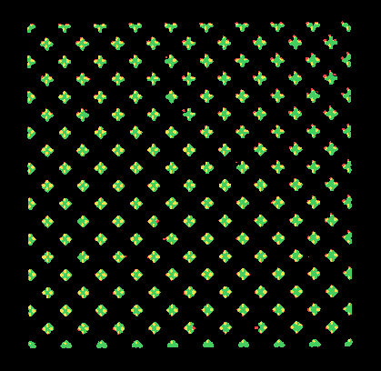
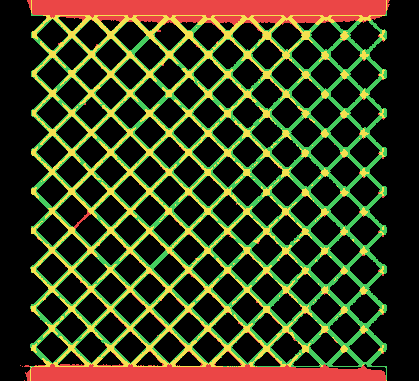

# TIFF vs STL validation

Generated 2026-07-27T23:53:15Z in 191.5 s.

## Inputs

- CT TIFF: `/Users/amannindra/Projects/llnl_data_science_challenge_2026/data/missing_struts/tif_stacks/210127_Brian_Tran_strut_lattices_0point5dash1 1 Slices.tif` [761, 815, 837] uint16
- STL: `/Users/amannindra/Projects/llnl_data_science_challenge_2026/data/missing_struts/stls/0.5.stl` (3,498,656 triangles)
- Design JSON: `/Users/amannindra/Projects/llnl_data_science_challenge_2026/data/missing_struts/octet_truss_9x9x9.json`
- Registered JSON: `/Users/amannindra/Projects/llnl_data_science_challenge_2026/data/missing_struts/registered_jsons/210127_Brian_Tran_strut_lattices_0point5dash1 1 Slices.json`

## Registration (design units -> CT voxels)

- Scale: 39.488809 voxels/design unit
- Rotation: 0.3351 deg; translation [np.float64(59.34), np.float64(52.183), np.float64(26.462)] voxels
- Residuals over 10206 junction pairs: RMS 3.327e-12 vox, max 5.679e-12 vox
- Implied voxel pitch: 58.375 um (nominal 58.1 um, deviation +0.47%)
- STL modelling orientation: `+z+x+y` ('+z+x+y' requested), CT hit fraction 0.3261 over 1,600,000 sampled surface points; runner-up `+y+z+x` at 0.4383

## Agreement

| metric | value |
| --- | --- |
| lattice-window Dice | 0.4483 |
| lattice-window IoU | 0.2889 |
| lattice-window CT within design (+1 cell) | 0.7347 |
| lattice-window design realized in CT (+1 cell) | 0.6036 |
| full-grid strict Dice | 0.3815 |
| full-grid strict IoU | 0.2357 |
| full-grid CT within design (+1 cell) | 0.5011 |
| full-grid design realized in CT (+1 cell) | 0.6040 |
| CT material volume | 11,667 mm^3 |
| STL solid volume | 24,325 mm^3 |
| voxelized STL volume | 13,554 mm^3 |

## Gates

- **PASS** registration_rms: 3.327e-12 vox <= 1.0
- **PASS** lattice_window_dice: 0.4483 >= 0.0 (full grid: 0.3815)
- **PASS** surface_points_in_grid: outside fraction 0.1004 <= 0.15

## Notes

- The registered JSON already stores junction positions in CT voxel
  coordinates; the design->CT transform is fitted from id-matched
  junction pairs, never tuned against the segmentation.
- The STL models its build plates on its +-Y axis, while the scanned
  part's plates lie at the CT +-Z extremes; the orientation search
  scores all 24 proper cube rotations against the CT mask to recover
  this modelling-frame rotation (near-cubic lattices make bounding
  boxes useless for it).
- The CT field of view crops the build plates; crop-opened solids
  cannot be morphologically filled, so full-grid metrics and the
  voxelized STL volume undercount plate material. The lattice-window
  numbers (junction bounding box + 2 cells) are the meaningful ones.
- CT solid volume differs from the design volume because printed struts
  differ from nominal thickness; that gap is signal, not error.

## Overlays

Red = CT only, green = STL only, yellow = agreement.

