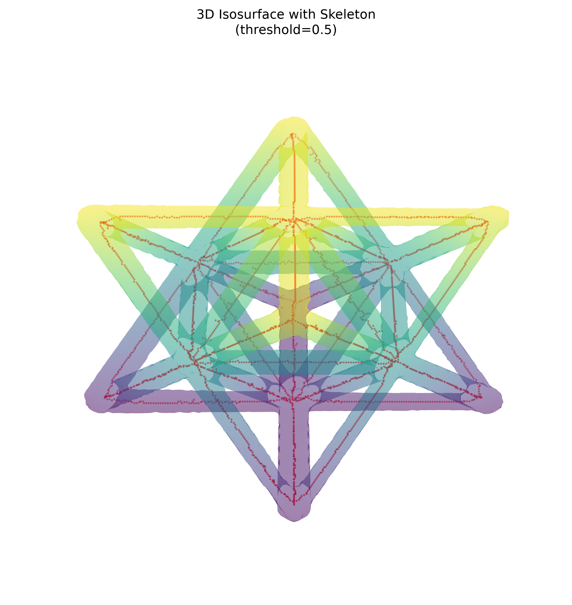
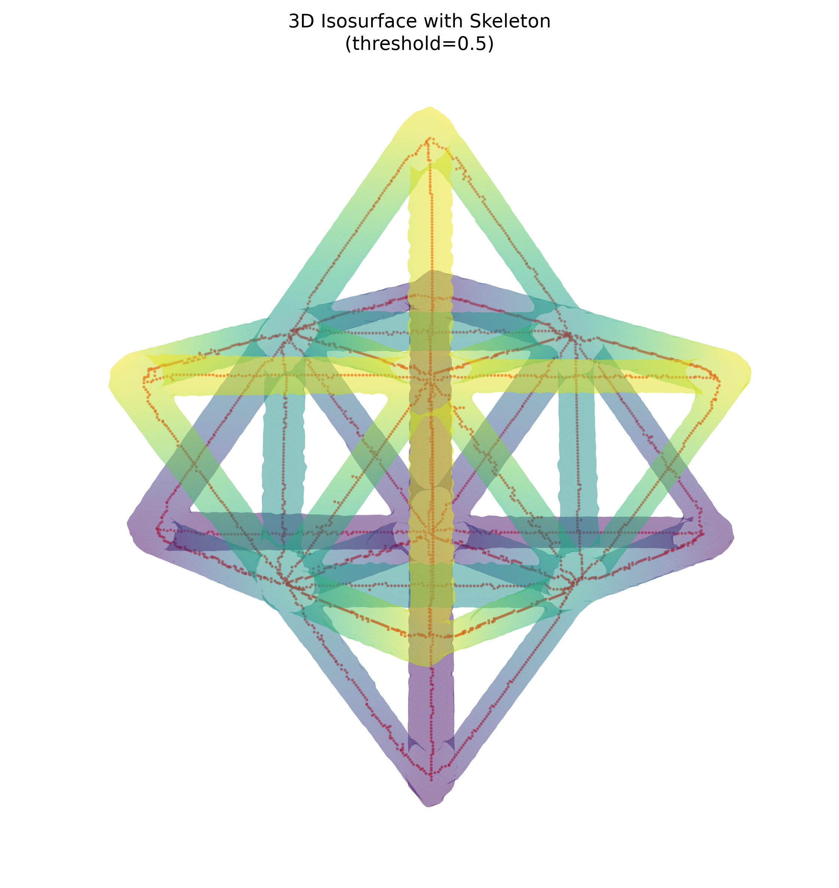

# Non-Destructive Evaluation Report: Unit Cell

## Input provenance

This Task 4 report was calculated directly from the existing Task 1–3 outputs; neither the segmentation nor the skeleton was regenerated.

| Role | Relative input path | Array type | Shape |
| --- | --- | --- | --- |
| Original CT volume | `../unitcell.npy` | `float32` | `(256, 256, 256)` |
| Segmentation mask | `../unitcell_segmented.npy` | `uint8` | `(256, 256, 256)` |
| Skeleton | `../unitcell_skeleton.npy` | `bool` | `(256, 256, 256)` |

All inputs existed, loaded successfully with NumPy (`allow_pickle=False`), were three-dimensional, and have matching shapes.

## Summary metrics

| Category | Metric | Value |
| --- | --- | ---: |
| Volume | Voxel count | 16,777,216 |
| Volume | Intensity dtype | `float32` |
| Volume | Intensity minimum | -0.0031287500 |
| Volume | Intensity maximum | 0.0152576920 |
| Volume | Mean intensity (complete volume) | 0.0005390669 |
| Segmentation | Foreground voxel count | 717,724 |
| Segmentation | Background voxel count | 16,059,492 |
| Segmentation | Foreground percentage | 4.277968% |
| Segmentation | Mean intensity within foreground | 0.0116967019 |
| Skeleton | Foreground voxel count | 3,182 |
| Skeleton | 26-connected components | 1 |
| Skeleton | Endpoints (26-neighbor degree = 1) | 39 |
| Skeleton | Junction voxels (26-neighbor degree >= 3) | 138 |
| Skeleton | Complexity: junction density | 43.368950 junction voxels / 1,000 skeleton voxels |

## Segmentation statistics

The mask is binary (`0` background, `1` foreground). It identifies 717,724 material/ROI voxels (4.277968% of the volume) and 16,059,492 background voxels. The foreground has a substantially higher mean CT intensity (0.0116967019) than the complete-volume mean (0.0005390669), consistent with selecting the denser lattice material.

### Threshold information

The existing `segment_ct_dataset` implementation uses an inclusive rule, `ct_data >= threshold`. The exact threshold used to produce the supplied mask is not recorded in the inputs and cannot be uniquely reconstructed. From the observed mask boundary, any threshold in `(0.0058680507354438305, 0.005870238412171602]` yields this same mask for this volume. The visualization threshold is separate: the supplied `3d_visualize.py` normalizes its downsampled volume and extracts the isosurface at `0.5`.

## Skeleton statistics

The skeleton contains 3,182 foreground voxels in one 26-connected component. Skeletal complexity is defined here as **junction density**: the count of skeleton voxels with at least three occupied neighbors in their 3x3x3, 26-neighbor neighborhood, divided by total skeleton voxels and scaled to 1,000 skeleton voxels. This produces 138 junction voxels / 3,182 skeleton voxels = **43.368950 per 1,000**. Neighbor-degree counts were 0 isolated, 39 endpoints, 3,005 degree-2 voxels, and 138 junction voxels.

## Visual gallery

Both views use the provided `visualize_3d_with_skeleton` functionality with the original CT volume, existing skeleton overlay, `threshold=0.5`, and `downsample_factor=2`.

### View A — elevation 30.0°, azimuth 45.0°



### View B — elevation 60.0°, azimuth 45.0°



## Mask-to-volume alignment analysis

The segmentation is spatially compatible with the original CT volume (identical shape) and selects high-intensity voxels: the lowest foreground intensity (0.0058702384) is above the highest background intensity (0.0058680507). The existing skeleton is fully contained in the segmentation mask (0 skeleton voxels outside the foreground), providing an additional consistency check that the centerline representation aligns with the segmented material. The two rendered isosurfaces with skeleton overlays provide qualitative inspection from the requested perspectives.

## Assumptions and limitations

- Voxel spacing was not supplied, so counts and skeleton complexity are reported in voxel units rather than physical length or volume.
- Junction density is a voxel-neighborhood complexity metric; diagonal adjacency and thick/narrow local geometry can affect neighbor degree, so it is not equivalent to a graph-node count after topology pruning.
- The visualization is a downsampled, normalized CT isosurface for display and is not a direct rendering of the binary segmentation mask.
- The exact historical segmentation threshold is unavailable; the interval above is inferred from the current volume and mask only.

## Reproducibility

Metrics were computed from the three provenance paths using NumPy loads with `allow_pickle=False`; mask and skeleton foreground are defined by values greater than zero. Connectivity and neighbor degrees use a full 3x3x3 (26-neighbor) structure with constant-zero boundaries. Visualizations were generated programmatically from `.agents/skills/nde_report_expert/scripts/3d_visualize.py` using `visualize_3d_with_skeleton` (its `__main__` sample paths were not used):

```text
visualize_3d_with_skeleton(
    'data/unitcell/unitcell.npy',
    'data/unitcell/unitcell_skeleton.npy',
    'data/unitcell/nde_report/view_a.png',
    threshold=0.5, downsample_factor=2, elev=30.0, azim=45.0)

visualize_3d_with_skeleton(
    'data/unitcell/unitcell.npy',
    'data/unitcell/unitcell_skeleton.npy',
    'data/unitcell/nde_report/view_b.png',
    threshold=0.5, downsample_factor=2, elev=60.0, azim=45.0)
```
