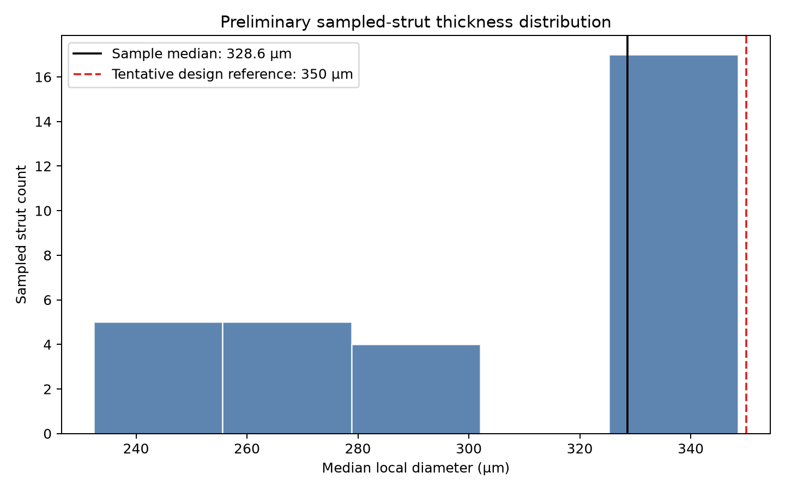
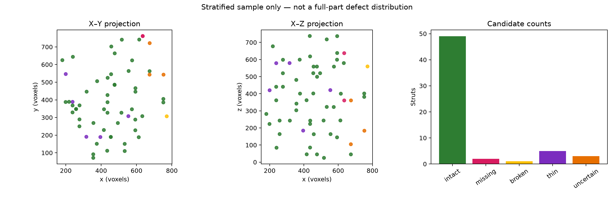

# Lattice CT Analysis — 60-Strut Report

> **Prototype status:** This is an automated, deterministic EDA workflow, not the final Part 2 system. Defect-candidate labels are produced by the transparent, provisional rules documented below; they are not validated defect labels.

## Status

- Alignment gate passed: **True**
- Sampled expected struts: **60** of 18,468
- Axis mapping: `JSON (x,y,z) -> CT array (z,y,x)`
- Provisional rule version: `rules-v2-missing-0.10`
- Residual correction: none; registered coordinates already include specimen tilt.

## Alignment evidence

- Otsu threshold: `40333.0` intensity units
- Material found within search neighborhood: `96.4%`
- Median centerline-to-material distance: `1.00` voxels (`58.1 µm`)
- 90th-percentile distance: `3.00` voxels (`174.3 µm`)

## How the prototype detects defect candidates

### Inputs and roles

- **Registered CT TIFF:** measured grayscale X-ray attenuation. Bright voxels are treated as candidate printed material after thresholding.
- **Registered JSON graph:** the nominal lattice topology and expected junction/strut coordinates. It identifies where a strut should exist; it does not contain defect labels.
- **Voxel spacing:** `58.09 µm` in each axis, used to convert distance-transform measurements from voxels to micrometres.

### Automated processing sequence

1. **Load without copying the full CT.** The TIFF is memory-mapped so local strut regions can be analyzed without allocating a second full volume.
2. **Estimate material intensity.** Otsu's method computes a global baseline threshold from sampled CT intensities.
3. **Verify JSON-to-CT alignment before analysis.** All six coordinate-axis permutations are scored on expected centerlines. The selected mapping must find material near at least 85% of sampled stations, with median distance ≤2 voxels and 90th-percentile distance ≤4 voxels. Failure stops the pipeline.
4. **Select a reproducible EDA sample.** A fixed random seed (`20260723`) round-robin samples 60 of 18,468 expected struts across interior/exterior regions, low/middle/high positions, and strut orientations.
5. **Extract one local ROI per expected strut.** The nominal centerline is sampled every 0.5 voxel. The first and last 10% are trimmed to reduce junction node contamination.
6. **Segment material three ways.** Each ROI is thresholded at 97%, 100%, and 103% of the Otsu threshold. A voxel is material when its intensity is greater than or equal to the tested threshold.
7. **Measure centerline support.** At every centerline station, the analysis searches up to 4 voxels for segmented material and records occupancy, the longest unsupported run, alignment distance, peak intensity, and local diameter.
8. **Assign a candidate class.** The rule hierarchy below is applied in order. The result, reason, features, and uncalibrated confidence are written to CSV.
9. **Summarize and visualize.** The pipeline writes a traceable feature table, metrics, and thickness and spatial-distribution plots.

### Feature definitions

- **Occupancy:** fraction of sampled centerline stations that have thresholded material within the 4-voxel search radius.
- **Gap fraction:** longest consecutive run without nearby material divided by the number of sampled stations.
- **Alignment error:** median distance from expected centerline stations to the nearest thresholded material.
- **Diameter:** twice the segmented-mask Euclidean distance-transform radius, summarized over the central 60% of the strut.
- **Threshold stability:** fraction of the three threshold tests whose coarse state agrees with the baseline Otsu result.

### Provisional classification rules

| Candidate | Automated rule | Interpretation |
|---|---|---|
| Missing | occupancy ≤ `0.10` at all three tested thresholds | Almost no CT material follows the expected strut. |
| Broken | occupancy ≤ `0.85` and gap fraction ≥ `0.15` | Some material exists, but a long internal interruption is present. |
| Uncertain | alignment error > `3.0` voxels or threshold stability < `0.667` | The geometry or segmentation is not stable enough for a stronger label. |
| Thin | valid interior intact measurement and diameter is at or below the sample-derived lower-tail cutoff | Supported material is unusually narrow relative to this exploratory sample. |
| Intact | none of the preceding rules apply | Material continuously supports the expected centerline under the provisional rules. |

Rules are evaluated in the order shown. Therefore, a nearly empty strut is classified as missing before the broken-strut rule is considered.

### What “confidence” means here

The CSV confidence value is an **uncalibrated rule-strength score**, not a probability that a prediction is correct. It combines threshold stability with either distance from the missing-occupancy boundary or centerline alignment quality. No labeled ground truth is available, so accuracy, precision, recall, and F1 cannot currently be reported honestly.

## Automated candidate summary

- Intact: `49/60` (`81.7%`)
- Missing: `2/60` (`3.3%`)
- Broken: `1/60` (`1.7%`)
- Thin: `5/60` (`8.3%`)
- Uncertain: `3/60` (`5.0%`)

- Classification coverage: `95.0%`
- Median threshold stability: `100.0%`
- Mean processing time: `0.054` seconds/strut

These are automated exploratory classifications and continuous measurements.

## Thickness

- Measured median across supported sample: `328.6066633530124` µm
- Valid interior thickness measurements: `31/60`
- Conservative thin-candidate cutoff: `232.36` µm
- Exterior thickness values are excluded because nearby solid skins/walls can contaminate the distance transform.
- The 350 µm value is shown only as an unconfirmed design reference.
- One voxel equals 58.09 µm, so segmentation and alignment errors materially affect diameter.

## Spatial distribution

The following projections show only the stratified 60-strut sample, not the full-part defect distribution.

## Outputs

- `alignment.json`: selected coordinate mapping, thresholds, stop criteria, and alignment evidence
- `sampled_struts.csv`: one row per sampled strut with coordinates, ROI features, predictions, reasons, confidence scores, runtime, and exclusions
- `pipeline_metrics.json`: automated coverage, stability, alignment, runtime, memory, thickness, and reproducibility metadata
- `thickness_reference.json`: exploratory diameter distribution and thin cutoff
- `thickness_histogram.png`: preliminary sampled thickness distribution
- `spatial_distribution.png`: sampled candidate locations

The JSON files can be opened directly in Cursor. The CSV is easiest to inspect with Cursor's table viewer, Python/pandas, or a spreadsheet tool. The Markdown report is the compact human-readable summary.

## Limitations and next decision

- This is a 60-strut stratified EDA sample, not the full lattice.
- The JSON describes nominal expected struts and contains no defect labels.
- Intentional versus manufacturing-caused missing struts cannot be inferred.
- Candidate percentages are not defect prevalence estimates for the full part.
- The provisional 10% all-threshold missing boundary, 15% gap boundary, and related rules were not supplied by the instructors and have not been scientifically calibrated.
- Thin classification remains exploratory until experts define or validate a criterion.
- The configured 350 µm design reference is unconfirmed; recent literature on a related specimen family reports 424 µm, so the applicable CAD revision must be checked before final thickness conclusions.
- Use the automated alignment, stability, coverage, runtime, and uncertainty evidence to decide whether the method is suitable for scaling.
