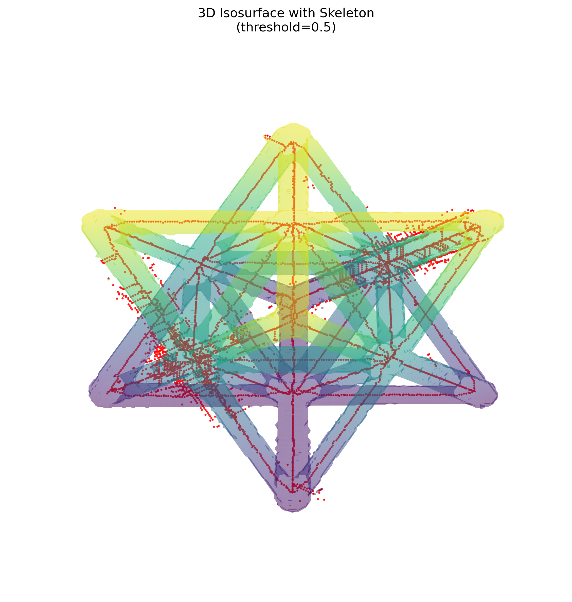
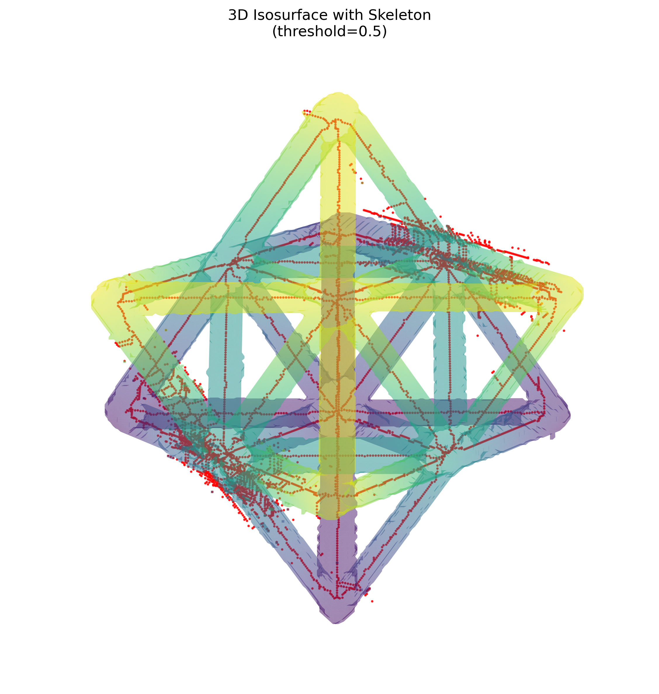

# NDE Report: Octet-Truss Unit Cell

## Dataset

This report analyzes the defect-free 256³ X-ray reconstruction in `data/unitcell` using its supplied segmentation and skeleton. All three arrays have shape **256 × 256 × 256**, so they are voxel-for-voxel compatible.

## Summary

| Source | Feature | Result |
|---|---|---:|
| Original volume | Array shape | 256 × 256 × 256 |
| Original volume | Total voxels | 16,777,216 |
| Original volume | Mean intensity (all voxels) | 0.0005391 |
| Original volume | Intensity range | −0.0031288 to 0.0152577 |
| Segmented mask | Foreground volume | 847,544 voxels |
| Segmented mask | Foreground fraction | 5.0518% |
| Segmented mask | Mean intensity inside ROI | 0.0103893 |
| Segmented mask | Mean intensity outside ROI | 0.0000150 |
| Segmented mask | 26-connected components | 341 |
| Skeleton | Skeletal length (voxel count) | 5,742 voxels |
| Skeleton | 26-neighbor endpoints | 341 |
| Skeleton | 26-neighbor branch-point voxels | 679 |
| Skeleton | Isolated skeletal voxels | 204 |
| Skeleton | 26-connected components | 328 |
| Alignment | Skeleton voxels inside mask | 5,742 / 5,742 (100%) |
| Alignment | Skeleton-to-mask voxel ratio | 0.6775% |

Skeletal complexity is reported as the skeleton's voxel-count length plus local topology counts. An endpoint has one occupied voxel in its 26-neighborhood; a branch-point voxel has three or more. These are voxel-level topology measures, not physical lengths or consolidated junction counts, because voxel spacing was not supplied.

## Visual Gallery

### View A — elevation 30°, azimuth 45°

### View B — elevation 60°, azimuth 45°

The translucent surface is the segmented mask; the red overlay is the supplied skeleton. The visualization uses the prescribed 0.5 normalized isosurface threshold and a downsampling factor of 2 for surface rendering.

## Analysis

The mask is strongly aligned with the intensity volume: mean intensity inside the ROI is approximately **694×** the background mean, indicating that the segmentation selects the high-intensity truss material rather than the surrounding field. The skeleton-to-mask check is exact at the voxel level: **no skeletal voxel lies outside the segmented foreground**. This supports good mask/skeleton registration and containment.

The mask contains 341 26-connected components and the skeleton contains 328. Together with 204 isolated skeleton voxels, this suggests that a small portion of the segmented material is represented by disconnected or very short skeletal fragments. These may reflect boundary fragments, small segmented objects, or topology introduced during skeletonization. The two views nevertheless show the main skeleton tracking the centers of the segmented struts. For physical volume or length values, multiply voxel counts by the appropriate voxel-volume or voxel-spacing calibration once that metadata is available.

## Method

- Loaded `unitcell.npy`, `unitcell_segmented.npy`, and `unitcell_skeleton.npy` and verified identical shapes.
- Treated nonzero segmentation and skeleton values as foreground.
- Calculated global and ROI intensity statistics, voxel counts, 26-connected components, and 26-neighbor skeleton topology.
- Generated both 3D views with the report skill's `3d_visualize.py` routine.
